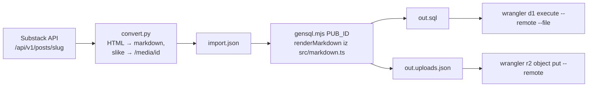

# Institucionalna stranica Savjeta: isporuka 2026-09-23

Što je isporučeno, stoji u [PLAN-tehnoetika-site.md §6](PLAN-tehnoetika-site.md#6-stanje-implementacije-2026-09-23). Ovaj dokument bilježi ono čega nema u kodu: kako je sadržaj uvezen, što je bilo zamka i što je ostalo otvoreno.

## Produkcija

- **Adrese:** `https://tehnoetika.domovina.ai` i `https://savjet.tehnoetika.com`. Na poddomeni canonical, RSS i sitemap pokazuju na vlastitu domenu (`src/index.tsx`), bez 301 preusmjeravanja. Namjerno: publikacija s upisanom domenom čiji DNS još ne radi inače bi ostala bez ikakve adrese.
- **Publikacija `savjet`** (id `708d8feb0e9548189039de16e102d8d3`, vlasnik lukagb@gmail.com): `home_layout = institution`, izbornik od 6 stavki, logo štita, akcent `#1f4e79`.
- Lukine testne objave "Test" i "Test 2" vraćene su u skicu, nisu obrisane.

## Uvoz sa Substacka (`scripts/substack-import/`)



1. Arhiva: `curl https://tehnoetika.substack.com/api/v1/archive?sort=new&limit=50`, zatim svaki post s `/api/v1/posts/<slug>` spremiš kao `<slug>.json` u `scripts/substack-import/`.
2. `python3 convert.py` (treba `markdownify` i `bs4`), pa preuzmi slike iz `import.json` u `img/<id>_<fn>`.
3. Bundle renderera, pa `node gensql.mjs <PUB_ID> out.sql`.
4. Prvo R2 upload iz `out.uploads.json`, zatim SQL. Obrnutim redom slike ostaju 404.

Specifično za ovaj uvoz (tvrdo kodirano u `gensql.mjs`):
- Post "Savjet za tehnoetiku i antitotalitarizam" postao je `about_md`, a ne objava.
- Deklaracija je stranica sa slugom `deklaracija`, `featured = 1` i PDF prilogom.
- Naslovnica koja je samo generički logo (500×500, 6 od 10 postova) se preskače. Taj logo je postao logo publikacije.
- SQL je idempotentan: ID-jevi su sha1 hash (`INSERT OR IGNORE`), a izbornik se ne dira ako ima ručno dodanih stavki.
- Substackov auto-alt ("Može biti slika sljedećeg: …") se odbacuje.

**PDF Deklaracije** nije Lukin izvorni dokument. Ispisan je headless Chromeom iz stranice `/deklaracija` preko `@media print` pravila u `style.css` (6 stranica A4):

```bash
"/Applications/Google Chrome.app/Contents/MacOS/Google Chrome" --headless=new --no-pdf-header-footer \
  --user-data-dir=/tmp/chrome-prof --print-to-pdf=Deklaracija.pdf --virtual-time-budget=8000 <URL>
```

Chrome zapiše PDF, a zatim ostane visjeti. Ubij ga kad se datoteka pojavi.

## Zamke koje su koštale vremena

| Zamka | Simptom | Rješenje |
|---|---|---|
| Hono JSX escapea `'` unutar `<style>{…}</style>` u `&#39;` | CSS varijable s imenima fontova su nevaljane, stranica tiho pada na sistemski sans | `dangerouslySetInnerHTML` za stil složen samo iz konstanti (`layout.tsx`) |
| Ugniježđeni `<form method="dialog">` unutar forme editora | parser ignorira unutarnji `<form>`, pa "Odustani" šalje cijelu objavu | dijalozi su izvan `<form class="editor">` |
| `<dialog>` događaj `close` u pozadinskoj kartici | Chrome ga ne isporuči dok kartica nije vidljiva, pa se slika ne umetne | umetanje na `click` gumba Umetni, ne na `close` |
| Brave na `localhost:8787` | prikazuje drugu aplikaciju ("Glazba") zbog service workera s istog origina | lokalno testiraj na `127.0.0.1:8787` (radi path mode `/@slug`) |
| `wrangler d1 execute --remote` | prvi poziv vrati 7403 "account not valid" | prolazna greška, drugi poziv prolazi |
| `media.kind` CHECK | SQLite ne mijenja CHECK ALTER-om | migracija 0003 iznova gradi tablicu `media` (na nju ne pokazuje nijedan FK) |
| marked propušta `javascript:` u `[x](…)` | stariji XSS vektor među tenantima | `renderMarkdown` neutralizira `javascript:`/`data:`/`vbscript:` u href/src, i s entitetima |

## Otvoreno

- Lukin feedback na izvještaj (poslan WhatsAppom 2026-09-23).
- Ime publikacije je samo "Savjet"; možda želi "Savjet za tehnoetiku i antitotalitarizam" ili "Tehnoetika".
- Aktivnosti, Video i Projekti su prazni do Lukinog unosa. Nijedan tok s pravim sadržajem nije provjeren pod Lukinim računom (dashboard je na produkciji provjeren samo na Matijinoj publikaciji `domovina`).
- Službeni PDF Deklaracije, ako postoji, treba zamijeniti generirani.
- Backlog ostaje: R2 video player (model spreman kroz `video_source`), RSVP, potpisnici, newsletter, `tehnoetika.hr` (tablica `publication_domains` + 301).

## Vezani dokumenti

- [PLAN-tehnoetika-site.md](PLAN-tehnoetika-site.md): plan, odluke, stanje po fazama
- [SPEC.md](SPEC.md): arhitektura platforme
